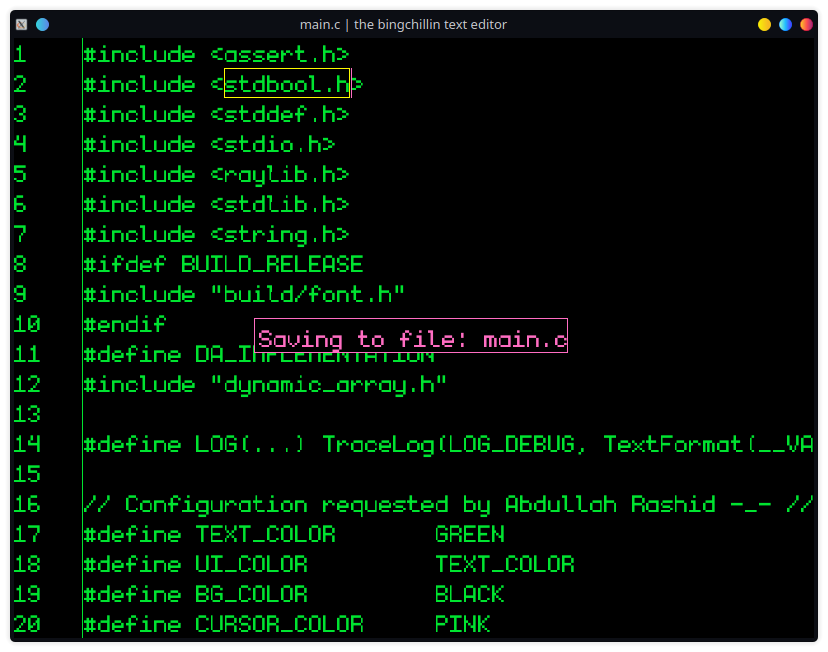

# the bingchillin text editor

Just writing this for fun in C with raylib for rendering.

## Controls

|Key        |Action                        |
|-----------|------------------------------|
|Ctrl =     |font size increase            |
|Ctrl -     |font size decrease            |
|Right Arrow|Cursor right                  |
|Left Arrow |Cursor left                   |
|Up Arrow   |Cursor up                     |
|Down Arrow |Cursor down                   |
|Backspace  |remove character before cursor|
|Delete     |remove character at cursor    |
|Enter      |insert a newline              |
|Home       |Cursor to line beginning      |
|End        |Cursor to line end            |
|Ctrl Home  |Cursor to file beginning      |
|Ctrl End   |Cursor to file end            |
|Ctrl Up    |Cursor to previous empty line |
|Ctrl Down  |Cursor to next empty line     |
|PageUp     |Cursor moves 10 lines up      |
|PageDown   |Cursor moves 10 lines down    |

## TODO

- [x] display line numbers
- [ ] maybe append a `\n` at the then when saving?
- [ ] proper cursor position calulation on font size change
- [ ] un-jankify the rendering (please.)
- [ ] implement text selection and basic selection operations
